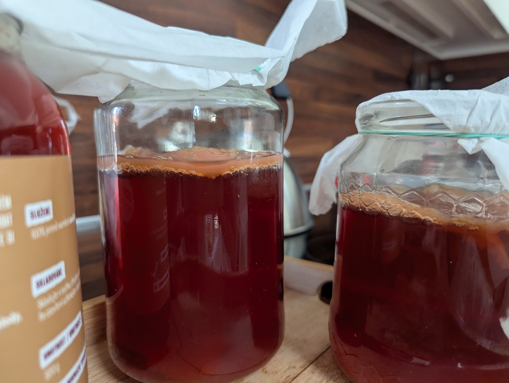
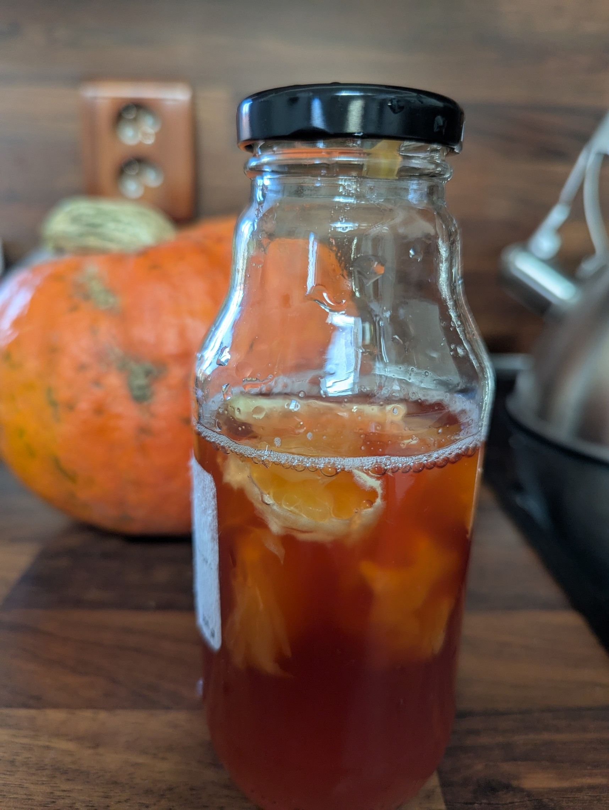

# Kombucha

Kombucha je zdraví prospěšný nápoj, který vzniká fermentací čaje. Na internetu je spousta zdrojů, které popisují zdravotní prospěch; já se omezím na detailní popis výroby.

---

# Výroba krok za krokem

1. **Příprava čaje**  
   Uvařím si litr libovolného čaje. Nejzdravější varianta vzniká z **černého čaje** (viz studie níže).  
   Lze použít i čaj zelený nebo ovocný. Kvalita čaje se projeví ve výsledném nápoji, proto se vyplatí na kvalitě čaje nešetřit.  
   Já jsem si oblíbil malinový čaj z Marks & Spencer, s nímž má výsledný nápoj krásně ovocnou, malinovou vůni.

2. **Slazení**  
   Po vylouhování čaje a odebrání lístků nebo sáčků je třeba čaj dostatečně osladit: minimum je **85 g cukru** (krystal nebo krupice) na jeden litr čaje. Větší množství cukru vyústí ve sladší nápoj.

3. **Chlazení**  
   Čaj nechám zchladnout na pokojovou teplotu. Houbu nelze dát do teplého čaje - tím by se zabila.

4. **Přidání kombuchové kultury**  
   Do chladného čaje vložím houbu (níže popisuji, jak ji získat). Sklenici zakryji hadříkem nebo papírovým ubrouskem a utěsním gumičkou. Takto nechám zrát na teplém místě, ovšem ne na slunci, přibližně 1 týden.  

   Vložená houba vytvoří **dceřinou kultura**, přičemž ta původní (mateřská) často klesne ke dnu. Dceřiná houba vytvoří na hladině vrstvu, která jakoby „zavíčkuje“ nápoj a oddělí ho od okolního prostředí. Na tomto obrázku jde obě kultury dobře vidět.

{: width="200" height="300"}`

5. **Dokončení výroby**  
   - Po týdnu vyjmu dceřinou houbu, opláchnu ji pod vodou a s trochou nápoje uložím v zavřené sklenici v lednici, abych ji mohl použít při příští výrobě. chladné prostředí růst houby zastaví. 
   - Nápoj zcedím do čistých sklenic, utěsním víkem a vložím do lednice. Tam vydrží několik týdnů.

---

# Zásadní pravidla
Postup jsme popsal detailně, ovšem není třeba se jej držet úzkostlivě, naopak mi připadá robustní vůči experimentování se silou čaje, množstvím cukru, dobou zrání, teplootu prostředí... Tři pravidla jsou však zásadní: 

1. **Dostatek cukru**: opravdu dejte alespoň **85 g cukru na jeden litr nápoje**.  
2. **Teplota čaje**: houbu vkládejte pouze do čaje, který má pokojovou teplotu.  

3. **Hygiena**: všechny sklenice i víčka promývám vroucí vodou, na houbu sahám pouze čistýma rukama, dbám na dobré utěsnění plátýnka kolem sklenice.

---

# Jak získat kombuchovou kulturu

1. Lze ji koupit v obchodě nebo získat od jiného pěstitele.  
2. Když koupíte chlazený (tedy nepasterizovaný) nápoj, zárodky houby v něm plavou. Z takového nápoje jsem kombuchu opakovaně pěstoval. Stačí se držet návodu výše, ovšem místo houby vložit cca 100 ml chlazené kombuchy.

---

# Experimentování

- Je možné **nechat nápoj zrát déle než týden** — čím déle fermentace probíhá, tím bude nápoj kyselejší. Naopak kratší doba fermentace vede ke sladší chuti.  
- Po scezení a vyndání houby je možné do nápoje vložit ovoce, utáhnout víčko (aby se lahev natlakovala) a nechat další **jeden den** kvasit. To přidá bublinky a ovocnou chuť. Podle obsahu cukru v ovoci je vhodné tlak průběžně upouštět, aby nápoj po otevření nevyšuměl.

{: width="200" height="300"}`

---

# Proč černý čaj?

Volba čaje má vliv na chuť, metabolity i zdravotní účinky výsledného nápoje.  
- Podle [této studie](https://www.sciencedirect.com/science/article/pii/S0963996919306684) má kombucha z černého čaje vyšší antioxidační kapacitu. Zkoumali také zelený čaj, ovocný čaj nikoliv. Z jejich shrnutí:
> A higher antioxidant capacity was found in black tea kombucha.
> Green tea kombucha had higher antibacterial and antiproliferative activites. 

- Další [výzkum](https://jn.nutrition.org/article/S0022-3166%2824%2901239-2/fulltext) testoval pouze vliv černého čaje a prokázal, že kombucha z něj může přispět k lepší ochraně střevní mikrobioty u lidí s i bez obezity.

---

