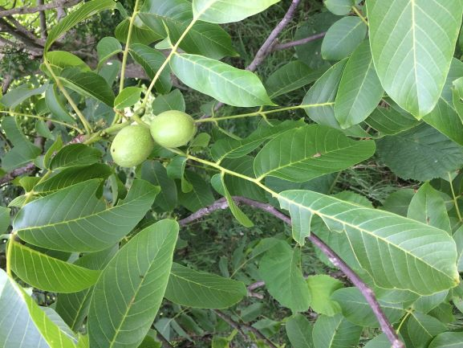
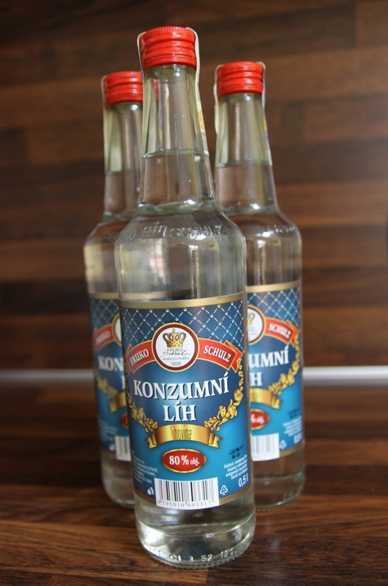

### Co je to ořechovka

Jeden rodinný známý nám léta dodával výbornou domácí [ořechovku](https://cs.wikipedia.org/wiki/O%C5%99echovka_(n%C3%A1poj)). Několikrát jsem si říkal, že ji zkusím vyrobit sám, protože základní postup je jednoduchý: na svatého Jana Křtitele (25. 6.) si nasbíráte nezralé zelené ořechy, nakrájíte je a naložíte do směsi alkoholu a koření. Necháte macerovat na sluníčku a z ořechů se vylouhuje spouta dobrých a vonných látek, z nichž je patrný především jód: čirý alkohol získá postupně tmavě hnědou barvu. Po nějaké době ořechy a koření scedíte, přidáte cukr (někdo jej přidává hned na začátek k ořechům) a necháte rozležet po dobu minimálně jednoho týdne. Poté můžete začít pít. 

### Který recept je ten nejlepší?

Jak už to bývá, ďábel tkví v detailu: není snadné zjistit, kolik _přesně_ ořechů použít, jak _silný_ má být alkohol, jaké _množství cukru_ do roztoku přidat, _v jaké fázi výroby_ cukr přisypat a další řadu detailů. Přesný recept našeho známého nebyl k mání a na internetu jsem našel širokou škálu postupů. Posuďte sami: 

- [Recept se spoustou cukru, nebo](https://www.apetitonline.cz/recept/orechovka-0)
- [s kandovanou citrónovou kůrou, nebo ](https://www.idnes.cz/hobby/domov/domaci-orechovy-liker.A130912_183145_hobby-domov_mce)
- [rychle uzrálá varianta s badyánem, nebo ](https://prima-receptar.cz/domaci-orechovka/)
- [se spoustou cukru a trochou jalovce a dlooouhým zráním, nebo ](https://abecedazahrady.dama.cz/clanek/jak-pripravit-svatojansky-liker-orechovice-krok-za-krokem)
- [se spoustou cukru a spoustou skořice, nebo ](https://www.toprecepty.cz/recept/2968-orechovka/)
- [se spoustou jalovce a macerací v silném alkoholu, nebo](https://www.receptyonline.cz/recept/napoj/orechovka-nasich-prababicek/)
- [s hřebíček a celým citrónem, nebo](https://www.jaktak.cz/jak-vyrobit-orechovy-liker-recept.html)
- [se dvojí macerací ořechů.](https://www.jaktak.cz/jak-si-vyrobit-domaci-orechovy-liker-recept.html)

Recepty se liší nejen postupem (_Mám ořechy macerovat v silném alkoholu a později výluh zředit, nebo alkohol naředit už na začátku?_, nebo _Po kolika týdnech přidat cukr?_), ale také použitými surovinami (_Mám to kořenit jalovcem?_), množstvím těchto surovin (_Jednu kuličku, nebo rovnou čtyři jalovce?_) a časy macerace a zrání. 

Receptů je tedy dost, ale který z nich je ten nejlepší? První nápad je stejně ďábelký jako množství surovin: **Vyzkouším každý z těch receptů a také jejich kombinace**: z prvního bych vzal množství cukru, z druhého použité koření, ze třetího časy macerace a zrání... Ano, tento postup je jistě možný, leč poněkud nepraktický, neboť **možných kombinací je 23,040** - tedy přes 23 tisíc receptů!

Měl jsem tedy nepřeberné množství možností a musel jsem vymyslet, **jak vybrat postup a kombinaci surovin, jimiž získám tu nejlepší ořechovku?** 

{: width="200" height="300"}`

(Líh je druhou nezbytnou surovinou pro výrobu.)

---

V následujícím postu najdete [pár slov o Design of Experiments](orechovka2.html), což je metoda, kterou jsem použil pro výběr zkušebních kombinací.
