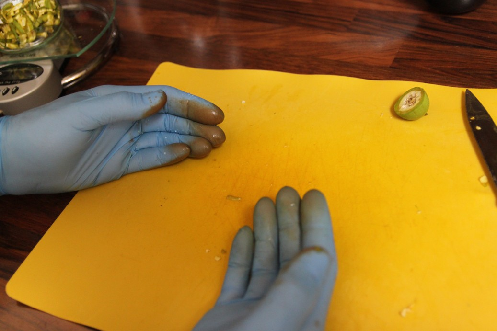

Nejzábavnější část celého projektu: konečně zjistím, jak vzorky chutnají a zda mezi chutí a vstupy existují vztahy, které předpokládám!

---

### Úkoly bez statistiky

Když jsem měl připravené designy, začala fyzická práce: ořechy jsem musel nasbírat, omýt, nakrájet a naměřit, vymýt skleničky, očíslovat je, navážit koření a devětkrát smíchat vše v patřičných množstvích. Začala macerace. Během ní jsem vzorky občas protřepal. Po třech týdnech jsem scedil šarže 2, 7 a 9 a přidal jsem k nim cukrový rozvar (tj. cukr rozvařený ve zbytku vody, kteoru bylo třeba dolít do naředění do 30 %). To samé jsem po 4,5 a 6 týdnech udělal s ostatními šaržemi a vše jsem nechával rozležet. 

Ořechy obsahují spoustu jódu, který ulpívá i na rukavicích:

Má domácí manufaktura před přípravou:

A takto vypadají šarže po namíchání:

Po prvním týdnu macerace je barva úplně jiná:

Toto jsou nakrájené ořechy po scezení:

### Jak mi vzorky chutnaly?

Po dalším týdnu jsem uskutečnil první kolo ochutnávání a o týden později ještě druhé, kontrolní kolo. 

Cílem ochutnávání bylo seřadit chutě od nejlepší k nejhorší. Byl to příjemný proces, ale ukázalo se, že při pouhých 9 vzorcích je porovnání velmi těžké! U některých vzorků jsem cítil, že "to není to pravé", ale odchylka od lepšího vzorku byla pokaždé trochu jiná a porovnat dva "horší" vzorky bylo obtížné - jednou byl příliš trávový, jednou naopak příliš citrónový. V prvním kole ochutnávání mne napadla myšlenka, v níž jsem se utvrdil v druhém kole: některé vzorky seskupím do kategorií o stejné jakosti, neboť nejsem schopen je mezi sebou porovnat. 

### Jak vzorky vyhodnotit?

V příkladu, na němž jsme vysvětlovali fungování DoE, je výstupem objektivně měřitelná veličina na spojité škále: v experimentech se může vytvořit např. 5,5 g, 6,5 a 13,8 g produktu. **Při ochutnávání je však výstupem pouze seřazení a to je podstatná komplikace** - namísto přesně naměřených hodnot jako 2,9, 3,1 a 8,9 jsem schpoen stanovit pouze pořadí, tj. hodnoty 1, 2, 3, které vůbec neobsahují informace o vzdálenosti kategorií, natož o tom, zda je vzdálenost konstantní. Navíc se ukázalo, že některé vzorky jsou natolik podobné, že jejich chuť ohodnotím stejně. Pro analýzu ordinálních je nutné použít nějaký sofistikovanější model než polynomickou regresi. Já jsem si zvolil **[Proportional Odds Model](https://en.wikipedia.org/wiki/Ordered_logit)** s logitovou funkcí jako linkem mezi předpokládanou závislostí uvedenou [v předchozím postu](orechovka4.html) a pořadím. 

---

V [dalším postu](orechovka6.html) si přečtete, jak dopadla analýza dat.
