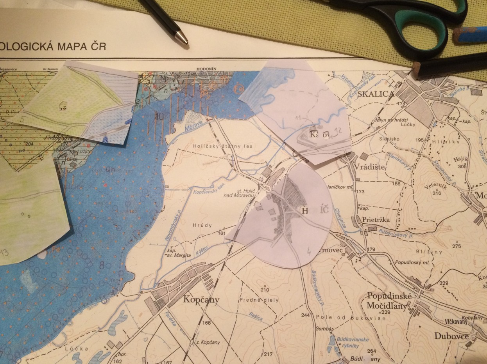
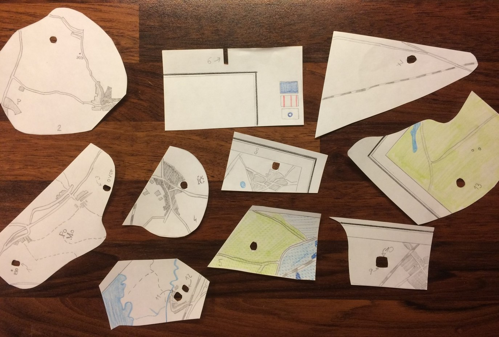
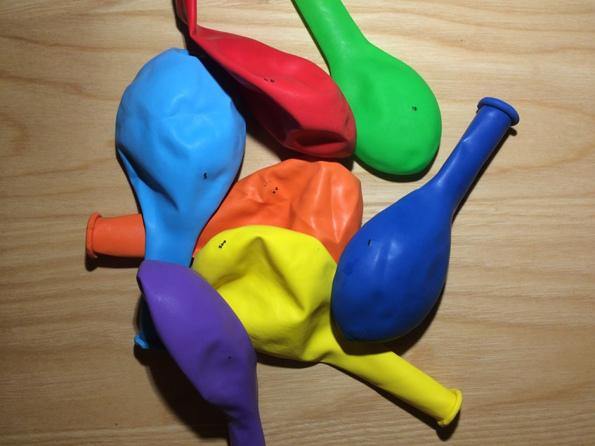
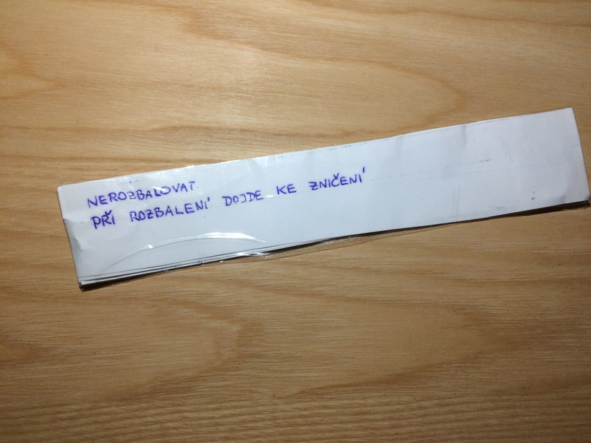
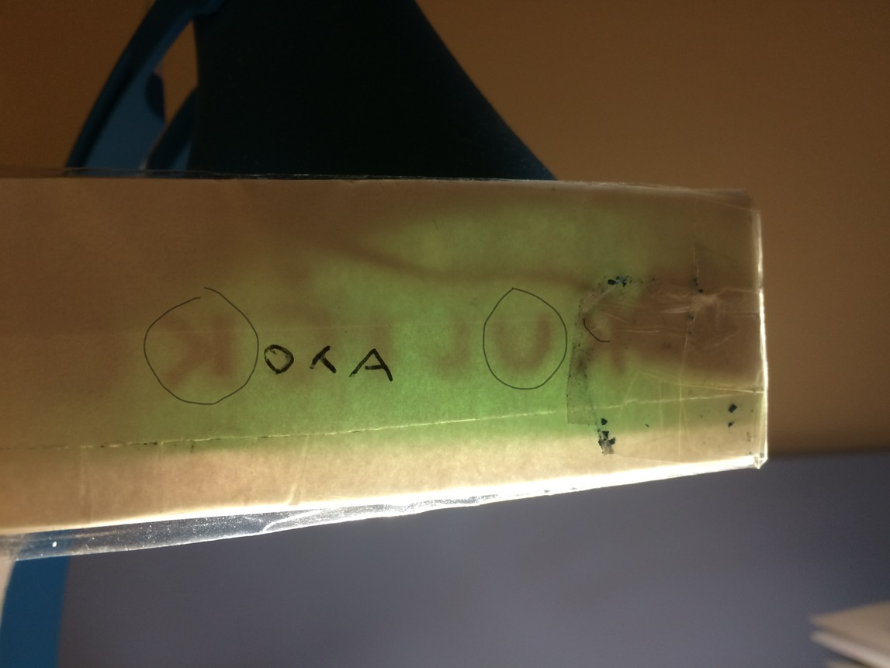
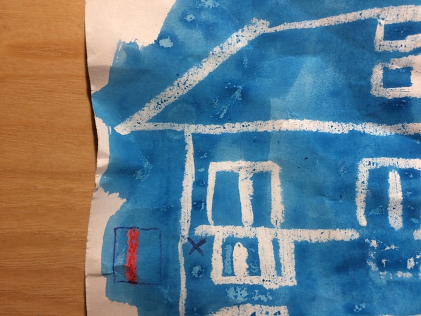

česky: Tato stránka obsahuje mé vlastní nápady na hádanky a šifry pr oděti, které ještě neumí číst, psát ani počítat. Budu rád za vaše [komentáře a tipy na vylepšení](https://github.com/vojtech-filipec/vojtech-filipec.github.io/issues/new). Většinu dojmu sdělí obrázky, proto se omezím na stručné anglické popisky.

It is a fun for me to prepare challenges for kids’ minds and then to watch them immersed in the search for solution, be it at home when you appreciate a period of silence for your own, let alone when travelling on a bus/train for a long period of time. Nonetheless, it may be a challenge for the adults to come up with a task that **requires neither writing, reading nor arithmetics** which are common ingredients of all possible playbooks. 

This page shall be an inspiration for anyone who wants to serve kids’ minds with simple-to-solve challenges. As far as I see the riddles are a great activity for children, and **the experience becomes much stronger if you pack the riddle into a story**: It can be an ancient letter explaining these riddles will lead them to a treasure box, or a request to help the secret agents find a lost diamond, or they may be promised to find a dinosaur skeleton at the end. You can write the letters yourselves and, indeed, you will have to read them too so do not worry about readability of your script. 

I believe a picture has the power of thousand words, so I will not post many comments here. On the contrary, you are encouraged to [share your hints and improvements](https://github.com/vojtech-filipec/vojtech-filipec.github.io/issues/new). 

## Incomplete map
Get any map and draw parts of it to a new sheet of paper. You do not have to draw each and every detail - it is sufficient to copy significant marks like railways, lakes, etc. Small hole in each tile displays a letter from the underlying map if placed correctly; rank of the letter in the keyword is on the tile. The initial 99 % of time needed for solving this about looking for a place at map. Eventually, nonetheless, the task requires a bit of reading at the end to get the keyword. 

## Invisible Ink
Using lemon juice or dissolved natrium carbohydrate (i. e. the kitchen powder soda) you can draw a plan or an object of interest on a white paper. Once heated above the candle, the script becomes visible. The paper shall have rather rough surface so that it absorbs the “ink” properly - a common bleached office paper with ultra-smooth surface may not be the right thing. I recommend drawing a small image of a candle (or packing one along with the sheet), so that kids get a hint how to approach this task.  

## Rainbow Balls
The kid finds seven deflated balls with strange black dots, and a carton with pictures, but what to do with them? This riddle actually consists of a few small tasks:
Solve a visual problem drawn at a paper sheet: What happens if it rains yet the sun is shining at the same time? The key here is “rainbow”.
Place the seven (inflatable) balls so that the colours correspond to the order of colors in the rainbow. I guess every book for children contains an image of rainbow. 
Inflate the balls and read the resulting keyword. 
The adult must inflate the balls beforehand and write the letters by a permanent marker with a narrow tip. 

## Schematic floor-plan of your flat
The concept of mapping (i.e. projection of 3D world on a flat sheet of paper which is 2D) is obvious to adults, but may be very hard for children who never encountered it. Draw a schema of your flat, place a red cross to mark “the treasure is here” and adjust the level by the age of children: 
- for very small kids, use colours and draw their room/bad with all familiar details (bed linen wih a real motive, favourite toys around the bad as in reality, dining table with a children seat) so that they can catch up,
- for older kids, limit the use of colours (or omit them entirely) and include various level of details: Will you draw the kitchen table and chairs, or just the wall ground-plan? Will you use a symbol for open door, or just leave a “hole” in a wall?

## Envelope that must stay sealed
A serious thing: This “envelope” consists of two parralel strips of paper, it is sealed by a tape and apparently there is something inside. The instructions say, however, DO NOT DISMANTLE; WILL BE DESTROYED UPON OPENING. If you carefully press it with your fingers you sense a string leading to a small flat object which is surely an explosive! Gosh, what are we up to?

The solution is to watch the object against a lamp. Then you see the secret code inside; letters K and U are highlighted by a circle so that you know what to search (the acronym OTA is not part of the keyword).

## Drawing by a white crayon
You can draw your house with a white wax crayon on a white paper and place a cross mark to where the treasure is (a balcony for instance). The child gets the white sheet with some sort of colour - it can be an ink, or a watercolour, or a powder colour. The was blocks absorption of the (watery) colour and the picture stands out. You can see a part of our house here:
