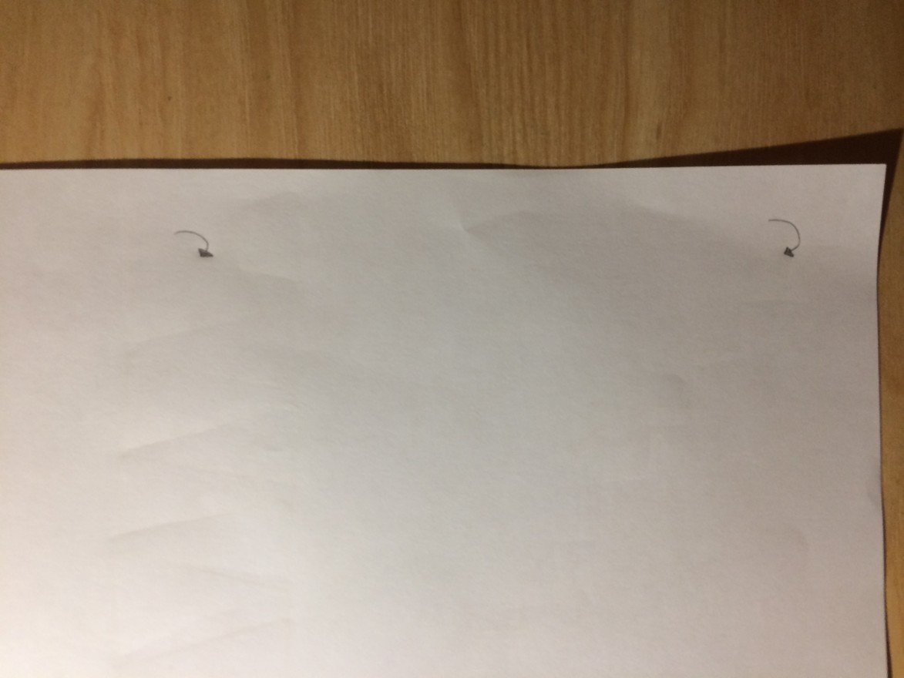
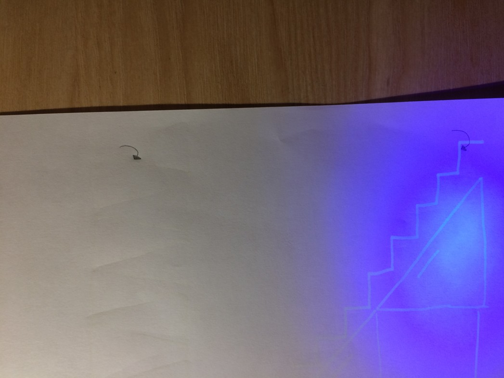
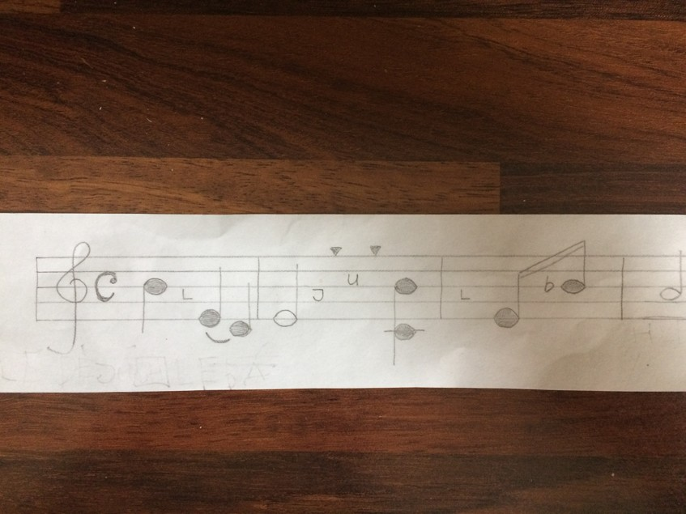
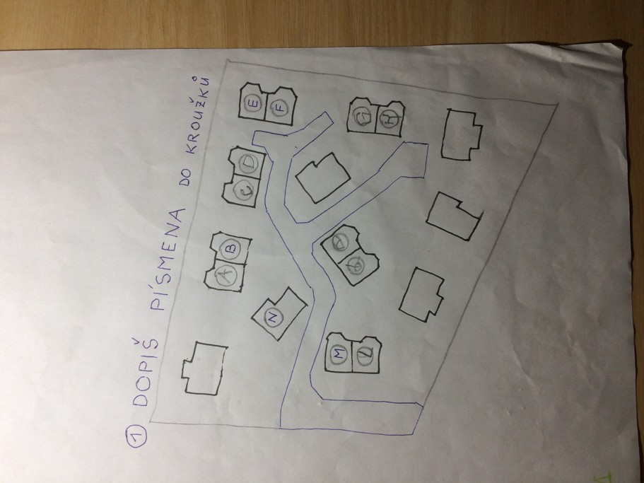
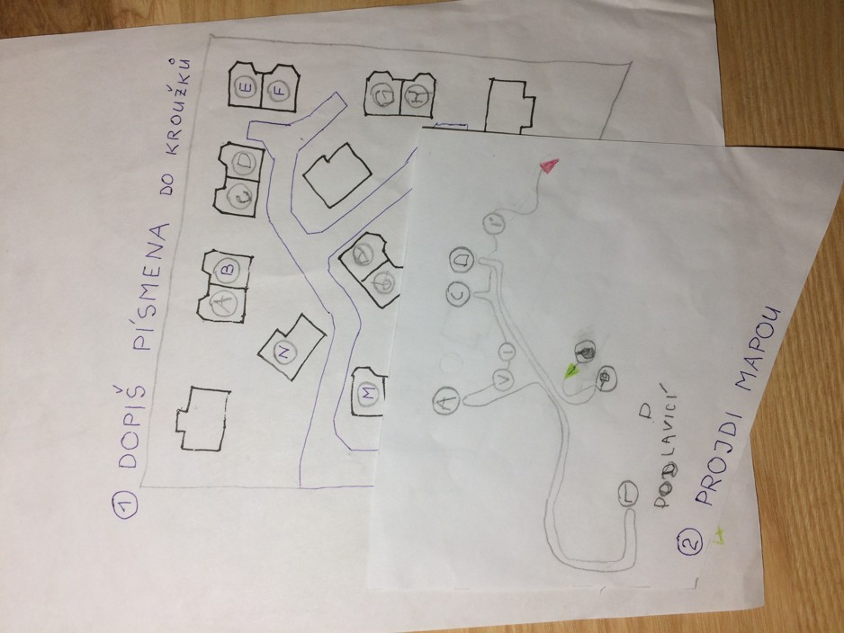
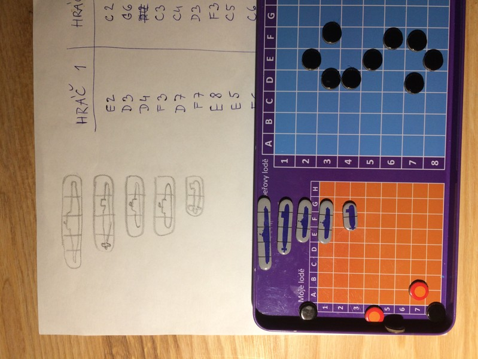
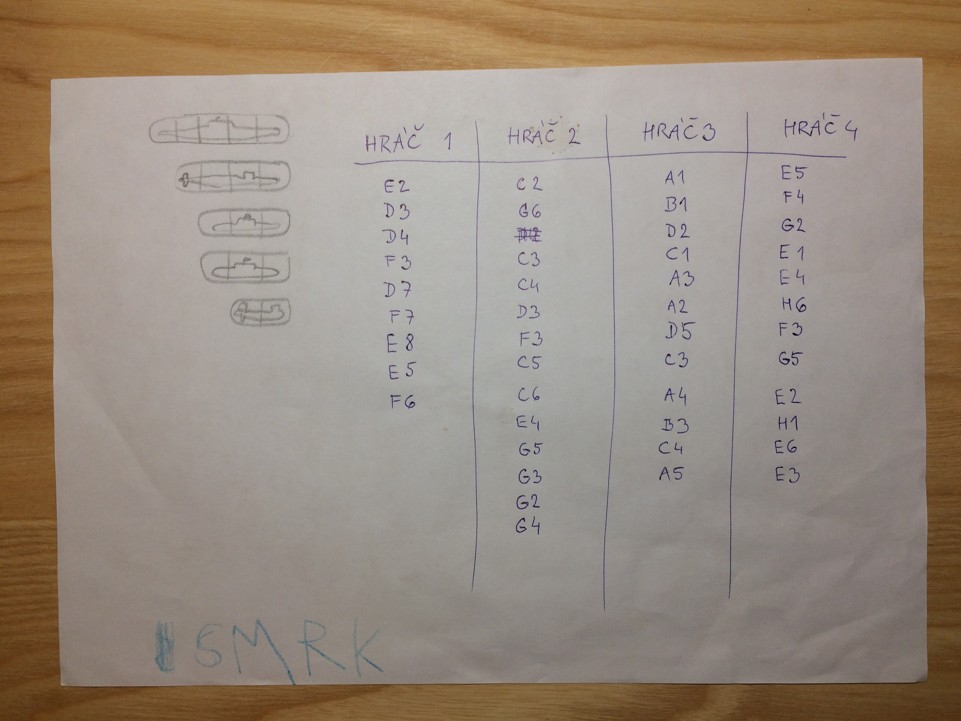
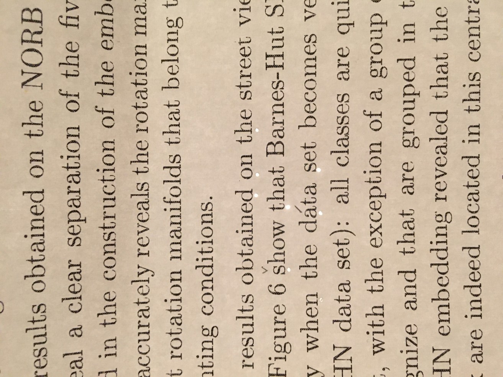
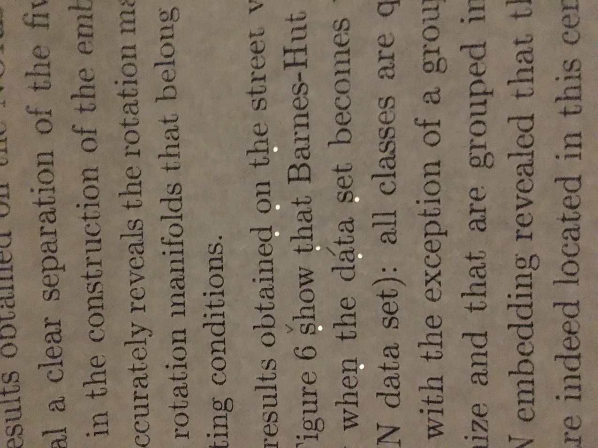
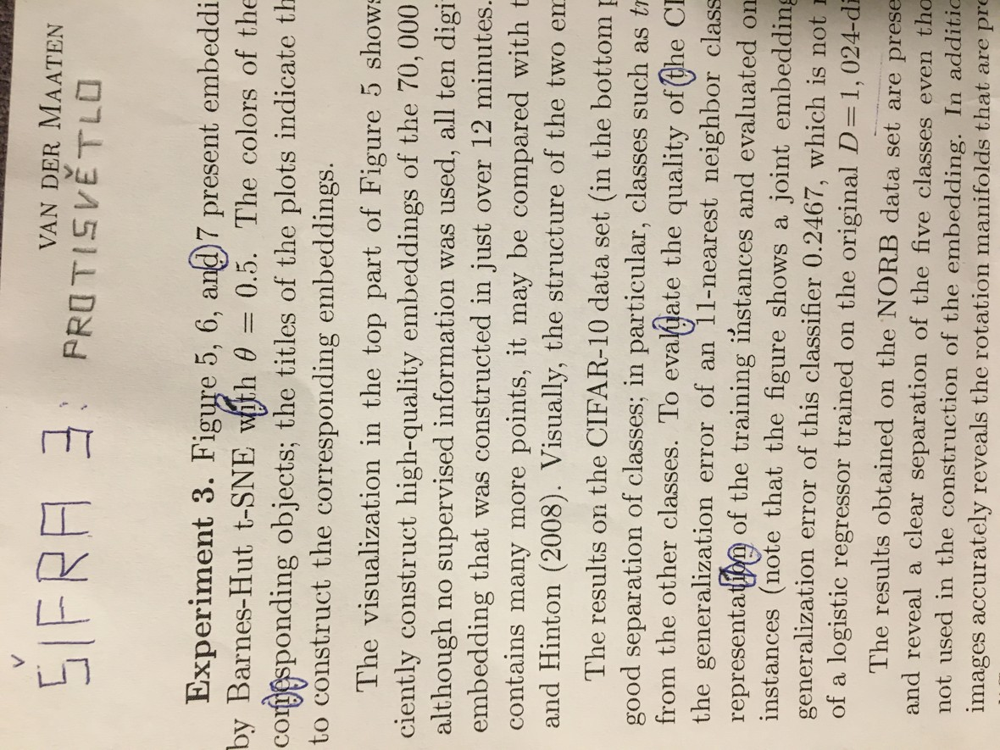

česky: Tato stránka obsahuje mé vlastní nápady na hádanky a šifry pro děti, které ještě neumí číst, psát ani počítat. Budu rád za vaše [komentáře a tipy na vylepšení](https://github.com/vojtech-filipec/vojtech-filipec.github.io/issues/new). Většinu dojmu sdělí obrázky, proto se omezím na stručné anglické popisky.

English: It is a fun for me to prepare challenges for kids’ minds and then to watch them immersed in the search for solution, be it at home when one appreciates a calm period of time, let alone when travelling on a bus/train for a long period of time. Nonetheless, it may be a challenge for the adults to come up with a task that **requires neither writing, reading nor arithmetics** which are common ingredients of all possible playbooks. 

This page shall be an inspiration for anyone who wants to serve kids’ minds with simple-to-solve challenges. As far as I see the riddles are a great activity for children, and **the experience becomes much stronger if you pack the riddle into a story**: It can be an ancient letter explaining these riddles will lead them to a treasure box, or a request to help the secret agents find a lost diamond, or they may be promised to find a dinosaur skeleton at the end. You can write the letters yourselves and, indeed, you will have to read them too so do not worry about readability of your script. 

I believe a picture has the power of thousand words, so I will not post many comments here. On the contrary, you are encouraged to [share your hints and improvements](https://github.com/vojtech-filipec/vojtech-filipec.github.io/issues/new). 

## Incomplete map
Get any map and draw parts of it to a new sheet of paper. You do not have to draw each and every detail - it is sufficient to copy significant marks like railways, lakes, etc. Small hole in each tile displays a letter from the underlying map if placed correctly; rank of the letter in the keyword is on the tile. The initial 99 % of time needed for solving this about looking for a place at map. Eventually, nonetheless, the task requires a bit of reading at the end to get the keyword. 

## Invisible Ink
Using lemon juice or dissolved natrium carbonate (i. e. the kitchen ash soda), you can draw a plan or an object of interest on a white paper. Once heated above the candle, the script becomes visible. The paper shall have rather rough surface so that it absorbs the “ink” properly - a common bleached office paper with ultra-smooth surface may not be the right thing. I recommend drawing a small image of a candle (or packing one along with the sheet), so that kids get a hint how to approach this task.  

## Rainbow Balls
The kid finds seven deflated balls with strange black dots, and a carton with pictures, but what to do with them? This riddle actually consists of a few small tasks:

- Solve a visual problem drawn at a paper sheet: What happens if it rains yet the sun is shining at the same time? This picture is distributed with the balls, and the key here is “rainbow”. 
- Position the seven (inflatable) balls so that the colours correspond to the order of colors in the rainbow. I guess every book for children contains an image of rainbow. 
- Inflate the balls and read the resulting keyword. 

The adult must inflate the balls beforehand and write the letters by a permanent marker with a narrow tip. 

## Schematic floor-plan of your flat
The concept of mapping (i.e. projection of 3D world on a flat sheet of paper which is 2D) is obvious to adults, but may be very hard for children who never encountered it. Draw a schema of your flat, place a red cross to mark “the treasure is here” and adjust the level by the age of children: 
- for very small kids, use colours and draw their room/bad with all familiar details (bed linen wih a real motive, favourite toys around the bad as in reality, dining table with a children seat) so that they can catch up,
- for older kids, limit the use of colours (or omit them entirely) and include various level of details: Will you draw the kitchen table and chairs, or just the wall ground-plan? Will you use a symbol for open door, or just leave a “hole” in a wall?

## Envelope that must stay sealed
A serious thing: This “envelope” consists of two parralel strips of paper, it is sealed by a tape and apparently there is something inside. The instructions say, however, DO NOT DISMANTLE; WILL BE DESTROYED UPON OPENING. If you carefully press it with your fingers you sense a string leading to a small flat object which is surely an explosive! Gosh, what are we up to?

The solution is to watch the object against a lamp. Then you see the secret code inside; letters K and U are highlighted by a circle so that you know what to search (the acronym OTA is not part of the keyword).

## Drawing by a wax crayon
You can draw your house with a white wax crayon on a white paper and place a cross mark to where the treasure is (a balcony for instance). The child gets the white sheet with some sort of colour - it can be an ink, or a watercolour, or a powder colour. The wax blocks absorption of the (watery) colour and the picture stands out. You can see a part of our house here:

## UV-visible pencil
This riddle requires a bit of a special equipment: a UV lamp and a transparent marker that is visible under the UV lamp. Both can be bought at a standard papershop at low costs. You can then draw anything: a map, a symbol for the keyword or a distinctive piece of your furniture where the actual treasure is hidden. Another option is to place an invisible marker to a visible image of, say, your garden. Or the opposite option that is at the pictures: the background schema is invisible, but two arrows show where to search.

Alternatively, any sort of invisible ink can be used as described in the respective riddle above. 

## Musical keys
This is suitable for children who can read musical keys: code the keyword into keys. Indeed it shall preferably consists of letters C, D, E, F, G, A, B and H; the picture shows a keyword that contains other letters too but the less the better. On the other hand, these extra letters give a hint how to interpret the keys. 

## Complete a map and follow a path
If you happen to find yourself on a camping site with places marked by _letters_ (i.e. not numbers), this two-phase quiz may come at hand. 

task #1: Walk through the site:

task #2: Read the letters in the correct order:

## Battleship quiz
Do you remember the battle of ships that you can play on a sheet of paper? We have a version with tin box and magnetic dots which makes it easier to get each letter; nonetheless, on the paper the quiz works similarly well.

This is how one letter of the key is coded:

My key consisted of four letters, so the full quiz looks as follows:

## A long text with perforation
This is how the quiz looks initially: some of the letters have diacritics inscribed, and there are small holes under lines: 

If you look against a light the perforation is clearly visible:

The collection of under-perforated letters forms the key:
